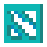
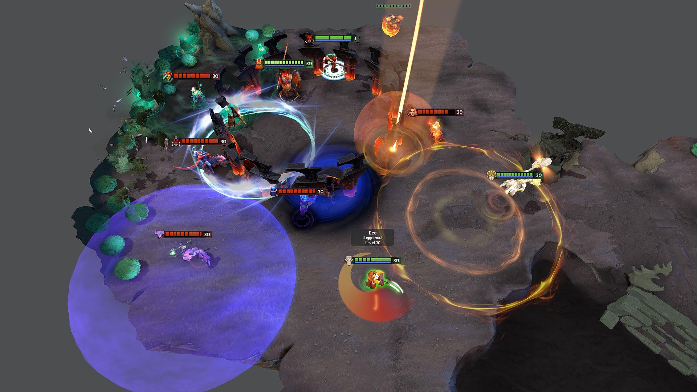
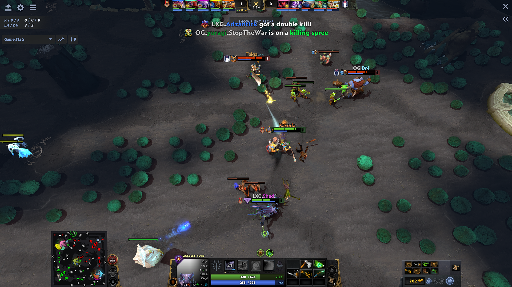
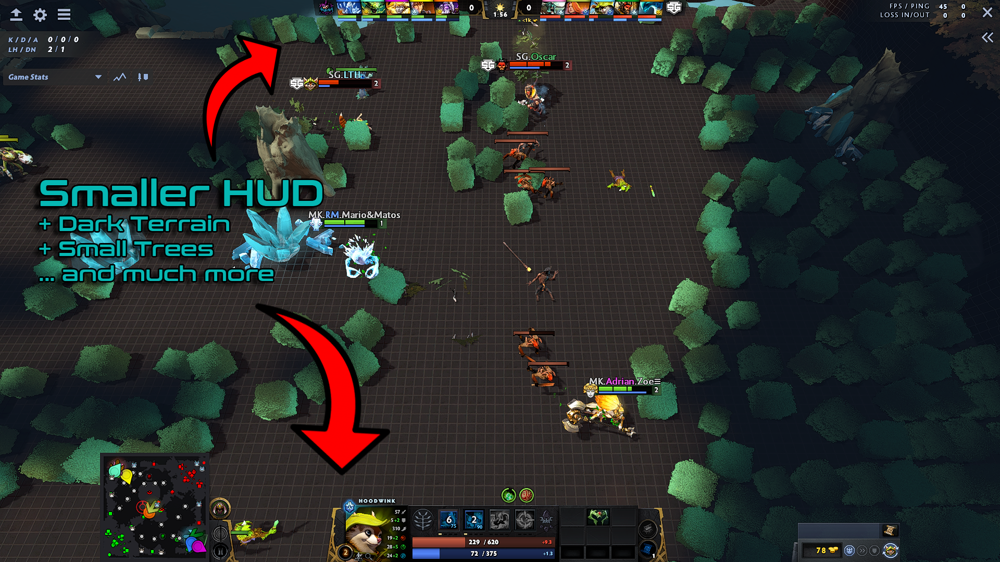
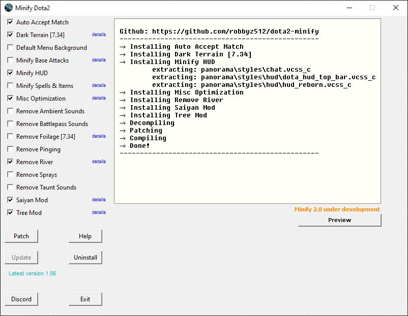
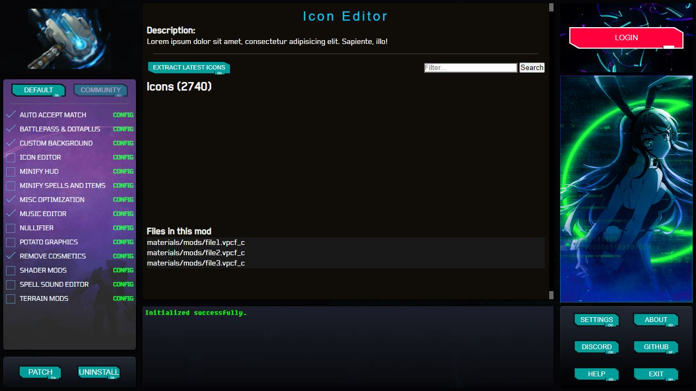

<!-- PROJECT LOGO -->
<h1 align="center">
  
   
  Dota 2 Minify
   
</h1>

  

<h4 align="center" style="font-weight: bold;">Modding is awesome</h4>

 

  ✔️500+ Spells Simplified •
  ✔️7,000+ files modded •
  ✔️Boost FPS •
  ✔️Creator Toolkit •

    
    
    
    

## :rocket: Installation

[Dota 2 Workshop Tools](https://developer.valvesoftware.com/wiki/Dota_2_Workshop_Tools) must be installed to use mods that edit the Interface like "Minify HUD". Skip step 1 if you don't want those.

1. Right-click on Dota 2 in Steam and select **Properties** > **DLC** then install **"Dota 2 Workshop Tools DLC"**

2. [Click here and download latest Minify(Full)](https://github.com/robbyz512/dota2-minify/releases)

3. Extract zip file and run Minify.exe then patch.

4. Go play dota2!

Optional: If you want to manually get Decompiler.exe and libSkiaSharp.dll

1. Open https://github.com/SteamDatabase/ValveResourceFormat/releases

2. Download "Decompiler-windows-x64.zip" (Get latest or use 0.5.0 if you have problems)

3. Extract both files into Minify folder.

Optional: To compile project from source [Click Here for instructions](https://github.com/robbyz512/dota2-minify/wiki/Minify#compiling-minify)

(<a href="#top">back to top</a>)

<!-- ABOUT THE PROJECT -->

## :books: Developing Your Own Mods

### You can create your own mods with Minify

[The wiki](https://github.com/robbyz512/dota2-minify/wiki/Dota2-Modding-Tutorials) will teach you the basics of working with steam files and more.

Once you get comfortable with the workflow you can use Minify to easily patch latest files from Dota2 and always have your mods updated.

## :open_file_folder: Minify File Structure [>> tutorial](https://github.com/robbyz512/dota2-minify/wiki/Minify)

| Name                                                                                  | Description                                                                                   |
| ------------------------------------------------------------------------------------- | --------------------------------------------------------------------------------------------- |
| [`Files`](https://github.com/robbyz512/dota2-minify/wiki/Minify#files)                | Compiled files you want to pack (Models, Meshes, Textures...etc)                              |
| [`blacklist.txt`](https://github.com/robbyz512/dota2-minify/wiki/Minify#blacklisttxt) | _Paths_ to files to replace with blanks so they wont appear in game (Particles, Sounds...etc) |
| [`styling.txt`](https://github.com/robbyz512/dota2-minify/wiki/Minify#stylingtxt)     | Custom CSS you want to apply to the Panorama (Interfaces, Layouts, HUD's...etc)               |
| `notes.txt`                                                                           | Optionally include this file to have a details button beside your mod for users to read.      |

## :video_game: Community

 

## :fast_forward: Future of this project

More customizable version of Minify in the making, big differences are each mod will have it's own configuration page letting you customize in more detail. For example adjusting textures, brightness and colors of mods like Dark Terrain and Tree Mod. Or picking spells and items to Minify. Other features would include replacing icons, music, sounds, hero voice lines, backgrounds with your own sounds and images.

### For Developers:

New app is being built with [Svelte](https://svelte.dev/) on the frontend and [Pywebview](https://pywebview.flowrl.com/) on the backend. I am looking for developers who'd like to help work on it. Contact me on discord or email me robattila128@gmail.com

    

(<a href="#top">back to top</a>)
