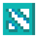
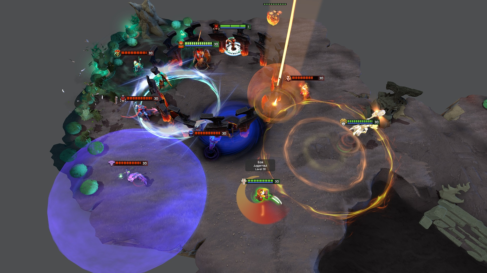
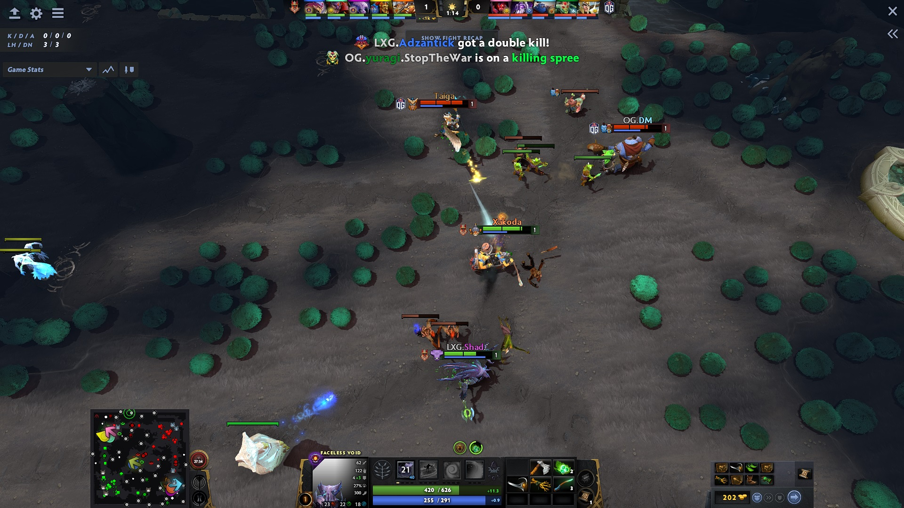
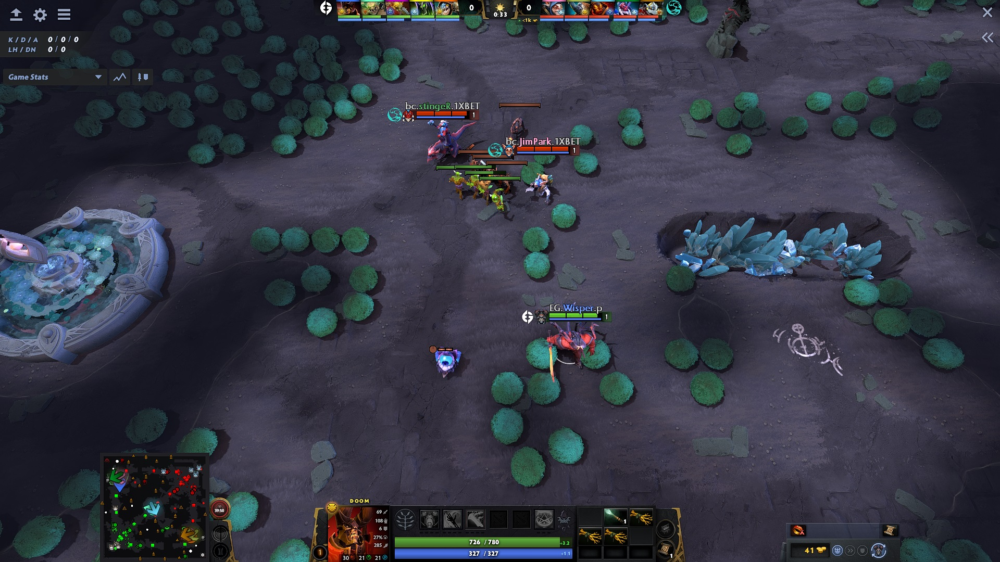
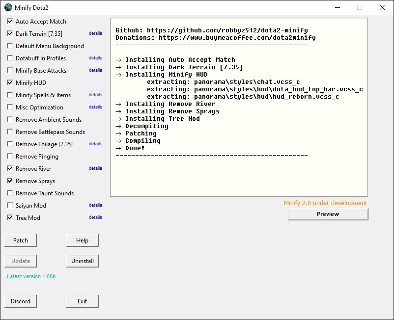

# ⚠️ NOTICE: Minify Has a New Maintainer ⚠️

I've **moved on to other projects** and am **no longer maintaining Minify**.

You can find their work here:  
🔗 **[Egezenn/dota2-minify](https://github.com/Egezenn/dota2-minify)**

<!-- PROJECT LOGO -->
<h1 align="center">
  
   
  Dota 2 Minify
   
</h1>

  

<h4 align="center" style="font-weight: bold; font-size:15px">All in one smart patcher for Dota2 to install all types of mods</h4>

 

  ✔️500+ Spells Simplified •
  ✔️8,000+ files modded •
  ✔️Boost FPS •
  ✔️Creator Toolkit

    
    
    
    

## :information_desk_person: Is this safe to use?

This open-source project has been around for over 3 years with thousands of downloads and users. While binaries are offered for ease of use, anyone can compile it themselves.

And no one has ever been banned for mods. This project strictly deals with mods and never hacking related things like memory/file manipulation. It is utilizing Valve's approved methods (VPK loading) for creating assets, as documented on the [official Valve Wiki.](https://developer.valvesoftware.com/wiki/VPK) Historically Valve has only disabled assets from loading and never punished modders. The worst thing that can happen is a mod stops working and that's it.

## :rocket: Installation

# ⚠️ NOTICE: Minify Has a New Maintainer ⚠️

I've **moved on to other projects** and am **no longer maintaining Minify**.

You can find their work here:  
🔗 **[Egezenn/dota2-minify](https://github.com/Egezenn/dota2-minify)**

<!-- ABOUT THE PROJECT -->

## :books: Developing Your Own Mods

### You can create your own mods with Minify

[The wiki](https://github.com/robbyz512/dota2-minify/wiki/Dota2-Modding-Tutorials) will teach you the basics of working with steam files and more.

Once you get comfortable with the workflow you can use Minify to easily patch latest files from Dota2 and always have your mods updated.

## :open_file_folder: Minify File Structure [>> tutorial](https://github.com/robbyz512/dota2-minify/wiki/Minify)

| Name                                                                                  | Description                                                                                   |
| ------------------------------------------------------------------------------------- | --------------------------------------------------------------------------------------------- |
| [`Files`](https://github.com/robbyz512/dota2-minify/wiki/Minify#files)                | Compiled files you want to pack (Models, Meshes, Textures...etc)                              |
| [`blacklist.txt`](https://github.com/robbyz512/dota2-minify/wiki/Minify#blacklisttxt) | _Paths_ to files to replace with blanks so they wont appear in game (Particles, Sounds...etc) |
| [`styling.txt`](https://github.com/robbyz512/dota2-minify/wiki/Minify#stylingtxt)     | Custom CSS you want to apply to the Panorama (Interfaces, Layouts, HUD's...etc)               |
| `notes.txt`                                                                           | Optionally include this file to have a details button beside your mod for users to read.      |

## :video_game: Community

 

